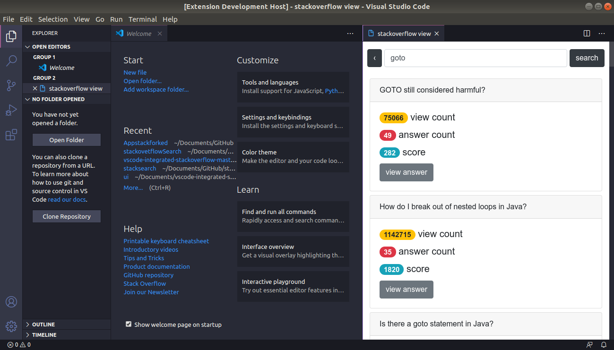

# stacksearch README

## Features

use **`ctrl+shift+3`** to start the extension or type **`open stackview`** in command palette. 

> See the demo image's below.

## Extension Settings

Include if your extension adds any VS Code settings through the `contributes.configuration` extension point.

For example:

This extension contributes the following settings:

* `myExtension.enable`: enable/disable this extension
* `myExtension.thing`: set to `blah` to do something

## Development

- `https://github.com/Deep1144/stackovetflowSearch` clone the repo.
- use `npm install` to install all dev dependencies.
- use `ctrl + f5` to run it in development env.

## Release Notes

### 1.0.0

Initial release of stacksearch use `ctrl+shift+3` or in command palette type `open stackview` to see this working.

-----------------------------------------------------------------------------------------------------------

## Working with Markdown

**Note:** You can author your README using Visual Studio Code.  Here are some useful editor keyboard shortcuts:

* Split the editor (`Cmd+\` on macOS or `Ctrl+\` on Windows and Linux)
* Toggle preview (`Shift+CMD+V` on macOS or `Shift+Ctrl+V` on Windows and Linux)
* Press `Ctrl+Space` (Windows, Linux) or `Cmd+Space` (macOS) to see a list of Markdown snippets

### For more information

Bug : <a href="https://github.com/Deep1144/stackovetflowSearch/issues">Report here</a>.

**Enjoy!**
